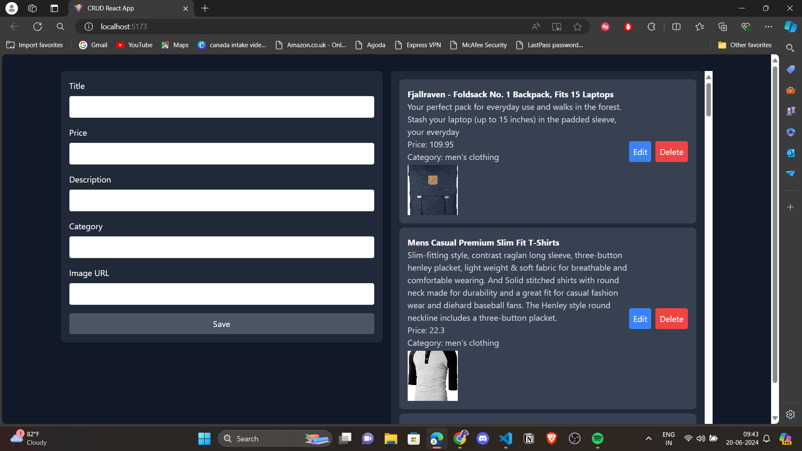

# CRUD App Documentation

## Table of Contents

- [Overview](#overview)
- [Features](#features)
- [Technologies Used](#technologies-used)
- [Project Setup](#project-setup)
- [Environment Variables](#environment-variables)
- [File Structure](#file-structure)

## Overview

This project is a simple CRUD (Create, Read, Update, Delete) application for managing products. The app allows users to add, edit, delete, and view products. Data is fetched from and sent to the [Fake Store API](https://fakestoreapi.com/).

## Features

- Add new products
- Edit existing products
- Delete products
- View a list of products
- API integration with `fakestoreapi.com` using Axios

## Technologies Used

- React
- Vite
- Axios
- Tailwind CSS
- Fake Store API

## Project Setup

To set up and run this project locally, follow these steps:

1.  **Clone the Repository:**

    ```
    git clone `https://github.com/Dewang007/CRUD_API_React.git`
    cd `CRUD_API_React`
    ```

2.  **Install Dependencies:**

    ```
     npm install
    ```

3.  **Run the Development Server:**

    ```
    npm run dev
    ```

## Environment Variables

    Create a `.env` file in the root directory and add the following variables:

    ```
    VITE_API_URL=https://fakestoreapi.com
    ```

## File Structure

```src/
│
├── api.js
├── App.jsx
├── components/
│ ├── Form.jsx
│ └── List.jsx
├── features/
│ └── products/
│ ├── productsSlice.js
│ └── productsReducer.js
└── store.js
```

## UI

    

    